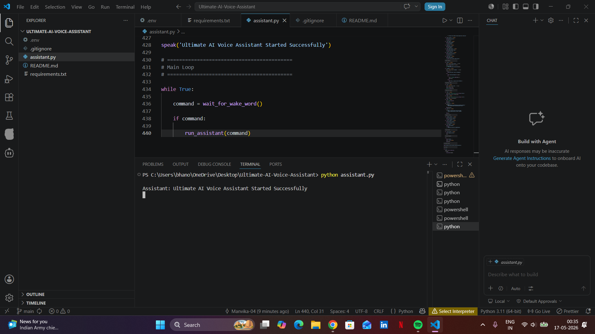

# Ultimate AI Voice Assistant

An AI-powered voice assistant built using Python and OpenAI.

## Features
- Wake word detection
- Open websites
- Open applications
- AI question answering
- Wikipedia search
- Play YouTube songs
- Productivity features
- Voice interaction

## Technologies Used
- Python
- OpenAI API
- SpeechRecognition
- pyttsx3
- pywhatkit

## Run Project

pip install -r requirements.txt

python assistant.py

## Project Screenshots

.png)

.png)

git clone https://github.com/Manvika-04/Ultimate-AI-Voice-Assistant.git
